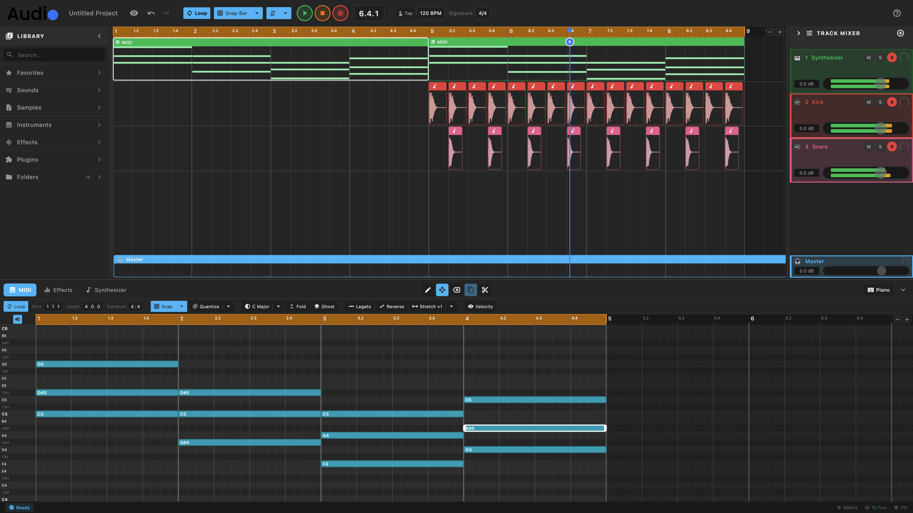

# Boojy Audio

A modern, cross-platform DAW (Digital Audio Workstation) designed for **speed, simplicity, and collaboration**.



## Download

[](https://github.com/tsbujacncl/boojy-audio/releases/latest/download/Boojy-Audio-v0.1.0-mac.dmg)
[](https://github.com/tsbujacncl/boojy-audio/releases/latest/download/Boojy-Audio-v0.1.0-win.exe)

Or visit [boojy.org](https://boojy.org) for more information.

## Overview

Boojy Audio combines professional workflows with beginner-friendly UX. Built with Flutter (UI) and Rust (audio engine), it's designed to work seamlessly across macOS, iPad, and eventually web, Windows, Linux, iOS, and Android.

**Current Status:** 🚧 M7 In Progress - VST3 Plugin Support (State Persistence Complete)

## Core Features (v1 MVP)

- 🎙️ **Record audio & MIDI** with metronome and count-in
- ✂️ **Edit with precision** - Piano roll with FL Studio-style preview, clip move/delete
- 🎚️ **Mix like a pro** - Built-in EQ/reverb/compressor/delay, stereo level meters
- 🎹 **Built-in instruments** - Polyphonic synthesizer with ADSR & filter
- 📋 **Track management** - Duplicate tracks, inline rename, resizable track heights
- 💾 **Save & export** - Project save/load, WAV export
- 📱 **Cross-platform** - macOS and iOS/iPad support
- ⌨️ **Keyboard-driven** - Comprehensive shortcuts and native menu bar
- 🎨 **Modern UI** - Ableton-style mixer, resizable panels, beat-based grid

## Recent Updates (December 2025)

### M7 - VST3 Plugin Support (In Progress)

**Core VST3 Features:**

- ✅ VST3 plugin scanning (Serum, Serum 2, Serum 2 FX detected)
- ✅ Plugin loading and audio processing
- ✅ MIDI note on/off event handling
- ✅ Plugin UI embedded in bottom panel (docked mode)
- ✅ Floating window support with position persistence
- ✅ Native NSView hosting via AppKitView on macOS
- ✅ Plugin state save/load with projects (base64-encoded blobs)
- 🚧 FX Chain view for visual effect management

### M6.8 - Track Height Resizing

✅ **Resizable Track Heights from Mixer Panel:**

- Drag bottom edge of mixer strips to resize track heights
- Master track: drag TOP edge (opposite direction)
- Heights sync between mixer panel and timeline view
- Range: 50px min to 300px max, 100px default (60px for master)

### M6.7 - Piano Roll Improvements

✅ **FL Studio-Style Note Preview:**

- Click and drag to preview notes before placing
- Real-time pitch audition while moving notes
- Improved note movement with horizontal constraints
- Delete notes with right-click or delete key

### M6.6 - iOS/iPad Support

✅ **Cross-Platform Expansion:**

- iOS support with FFI linking and proper audio initialization
- iPad/touch compatibility improvements
- Configurable audio latency control (buffer size settings)
- Optimized audio callback for mobile performance

### M6.5 - MIDI & Arrangement Improvements

✅ **MIDI Playback & Editing:**

- Fixed MIDI clips rendering in timeline
- MIDI clip move and delete functionality
- Fixed note-off triggering at exact clip boundary
- Piano roll note audition while editing

✅ **Arrangement View Enhancements:**

- Beat-based grid display with transparency
- Improved grid alignment and visual clarity
- Fixed pan implementation with proper stereo imaging
- Stereo level meters in mixer

✅ **Code Quality:**

- Refactored daw_screen.dart: extracted service managers
- Fixed audio file routing to correct tracks
- Fixed library path resolution for different working directories
- Improved error handling throughout

### Previous Updates (M6.4 - December 2025)

✅ **Bug Fixes & Synth Refinements:**

- Virtual piano now works during pause/stop (audio stream stays active)
- MIDI clip bar-snapping (Ableton-style: clips align to bar boundaries)
- Simplified synthesizer architecture:
  - Single oscillator (sine/saw/square/triangle)
  - One-pole lowpass filter with cutoff control
  - ADSR envelope (attack, decay, sustain, release)
  - 8-voice polyphony with voice stealing
- Ableton-style mixer UI redesign
- Inline track rename feature

### Previous Updates (M6.3 - October 2025)

✅ **Native macOS Menu Bar & Editor Panel:**

- Native macOS menu bar integration with PlatformMenuBar
- All keyboard shortcuts working natively through macOS system
- Panel toggle methods for Library, Mixer, Editor, and Virtual Piano

### Previous Updates (M6.1-6.2 - October 2025)

✅ **MIDI & Instruments:**

- Piano roll editor with FL Studio-style layout
- Polyphonic synthesizer (8 voices, ADSR, filter)
- Virtual piano keyboard (computer keyboard mapping)
- Instrument browser with drag-and-drop workflow

✅ **UI Polish:**

- Professional 3-panel layout (Library | Timeline | Mixer)
- Resizable panel dividers (drag to adjust, double-click to collapse)
- Track duplication with full state copying
- Compact zoom controls in timeline header

## Tech Stack

- **UI:** Flutter (cross-platform)
- **Audio Engine:** Rust (native + WASM-ready)
- **Cloud:** Firebase Firestore
- **Plugin Support:** VST3 (optional module)

## Architecture

```
┌─────────────────────────────────────┐
│   UI Layer (Flutter)                │  ← Cross-platform UI
└──────────────┬──────────────────────┘
               │ flutter_rust_bridge
┌──────────────▼──────────────────────┐
│   Audio Engine Core (Rust)          │  ← Platform-agnostic DSP
│   - Audio graph, DSP, automation    │
│   - Built-in FX & instruments       │
└──────────────┬──────────────────────┘
               │
    ┌──────────┴──────────┐
    │                     │
┌───▼─────┐         ┌────▼──────┐
│ Native  │         │  Web      │
│ I/O     │         │  I/O      │
│ (CPAL)  │         │ (WebAudio)│
└─────────┘         └───────────┘
```

## Project Structure

```
/engine         # Rust audio engine
  /core         # Platform-agnostic DSP & graph
  /dsp          # Built-in effects & instruments
  /host-vst3    # VST3 hosting (optional)
  /io           # I/O backends (native/web)
  /bridge       # FFI glue for Flutter
/ui             # Flutter application
  /lib          # Dart code
    /screens    # Main views
    /widgets    # Reusable components
    /state      # State management
  /assets       # Icons, fonts, samples
/packs          # Starter sample packs
/docs           # Documentation
```

## Setup Instructions

### Prerequisites

- **Rust:** `curl --proto '=https' --tlsv1.2 -sSf https://sh.rustup.rs | sh`
- **Flutter:** [Install Flutter](https://docs.flutter.dev/get-started/install)
- **macOS:** Xcode Command Line Tools
- **Windows:** Visual Studio 2022 with "Desktop development with C++" + CMake

### Windows VST3 Setup

For VST3 plugin support on Windows:

1. **Install Build Tools:**
   - CMake: `winget install Kitware.CMake`
   - Visual Studio 2022 Community with "Desktop development with C++" workload

2. **Build VST3 C++ Libraries:**
   ```powershell
   cd engine/vst3_host
   mkdir build_win
   cd build_win
   cmake -G "Visual Studio 17 2022" -A x64 ..
   cmake --build . --config Release
   cd ../../..
   copy engine/vst3_host/build_win/lib/Release/*.lib engine/lib/
   ```

3. **VST3 Plugin Paths:**
   - Default: `C:\Program Files\Common Files\VST3\`
   - Custom paths can be added via plugin browser in app

### Build & Run

```bash
# Clone the repository
git clone https://github.com/tsbujacncl/boojy-audio.git
cd boojy-audio

# Build Rust engine
cd engine
cargo build --release

# Run Flutter app
cd ../ui
flutter run -d macos    # macOS
flutter run -d windows  # Windows
```

## Development Roadmap

See [`docs/IMPLEMENTATION_PLAN.md`](docs/IMPLEMENTATION_PLAN.md) for detailed milestone breakdown.

| Milestone | Focus                       | Status      |
|-----------|-----------------------------|-------------|
| **M0**    | Project Setup               | ✅ Complete |
| **M1**    | Audio Playback              | ✅ Complete |
| **M2**    | Recording & Input           | ✅ Complete |
| **M3**    | Editing                     | ✅ Complete |
| **M4**    | Mixing & Effects            | ✅ Complete |
| **M5**    | Save & Export               | ✅ Complete |
| **M5.5**  | UI Polish & Resizable Panels| ✅ Complete |
| **M5.6**  | Track Duplication           | ✅ Complete |
| **M6**    | MIDI & Piano Roll           | ✅ Complete |
| **M6.1**  | MIDI Playback Fixes         | ✅ Complete |
| **M6.2**  | Toolbar Reorganization      | ✅ Complete |
| **M6.3**  | Native Menu Bar & Editor    | ✅ Complete |
| **M6.4**  | Bug Fixes & Synth Refinements | ✅ Complete |
| **M7**    | VST3 Plugin Support         | 🚧 In Progress |
| **M8**    | Stock Instruments           | 📋 Planned  |
| **M9**    | Polish & UX                 | 📋 Planned  |
| **M10**   | Beta Testing & Launch       | 📋 Planned  |

## Documentation

- [MVP Specification](docs/MVP_SPEC.md) - Full feature set and design decisions
- [Implementation Plan](docs/IMPLEMENTATION_PLAN.md) - Milestone breakdown and timelines

## Keyboard Shortcuts (v1)

| Shortcut              | Action                  |
|-----------------------|-------------------------|
| Space                 | Play/Stop               |
| R                     | Record toggle           |
| B                     | Toggle Library Panel    |
| M                     | Toggle Mixer Panel      |
| Cmd+K                 | Command Palette         |
| Cmd+S                 | Save                    |
| Cmd+Shift+S           | Save to Cloud           |
| Cmd+Z / Cmd+Shift+Z   | Undo/Redo              |
| Tab                   | Toggle Piano Roll ↔ Step Sequencer |

[Full shortcut reference](docs/MVP_SPEC.md#keyboard-shortcuts-starter-set)

## Contributing

This project is currently in early development (pre-v1). Contributions will be welcomed after beta launch (M10).

## License

MIT License - See [LICENSE](LICENSE) for details.

## Contact

- **GitHub:** [@tsbujacncl](https://github.com/tsbujacncl)
- **Repository:** [boojy-audio](https://github.com/tsbujacncl/boojy-audio)

---

**Built with ❤️ using Rust and Flutter**

