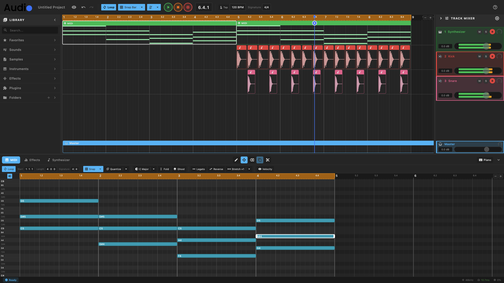

# Boojy Audio

A modern, cross-platform DAW (Digital Audio Workstation) designed for **speed, simplicity, and collaboration**.



## Download

[](https://github.com/tyrbujac/boojy-audio/releases/latest)

Or visit [boojy.org](https://boojy.org) for more information.

**Current Status:** Alpha (v0.1.5) — See [CHANGELOG.md](CHANGELOG.md) for details.

## Features

- **Multi-track recording** — Audio and MIDI, with count-in, punch in/out, and input monitoring
- **Piano roll editor** — Note drawing, velocity editing, scale/key highlighting, real-time preview
- **Mixing** — Per-track volume, pan, mute/solo, built-in EQ, compressor, reverb, delay, limiter
- **Track automation** — Volume and pan lanes with draw, select, delete, duplicate, slice tools
- **VST3 plugin support** — Scan, load, and host instruments and effects (docked or floating UI)
- **Audio editing** — Warp/time-stretch, pitch shift, clip splitting, consolidation, looping
- **Library browser** — Browse sounds, instruments, effects, and plugins with audio preview
- **MIDI import/export** — Standard MIDI file support (.mid)
- **Project management** — Save/load projects, auto-save, WAV/MP3/stem export
- **Keyboard-driven workflow** — Command palette (Cmd+K) and shortcuts for everything

See [ROADMAP.md](docs/ROADMAP.md) for the full feature tracker and version plan.

## Tech Stack

- **UI:** Flutter (Dart)
- **Audio Engine:** Rust (native performance, WASM-ready)
- **FFI:** C bindings (Rust ↔ Dart via `dart:ffi`)
- **Plugins:** VST3 hosting (C++ bridge)

## Project Structure

```text
/engine              # Rust audio engine
  /src               # Core modules: audio graph, synth, effects, sampler, FFI
  /vst3sdk           # VST3 SDK (submodule)
  /vst3_host         # VST3 C++ bridge
/ui                  # Flutter application
  /lib               # Dart source
    /screens          # Main views (DAW screen, mixins)
    /widgets          # UI components (timeline, mixer, transport, piano roll)
    /services         # Commands (undo/redo), audio engine interface
    /theme            # Boojy Design System (colors, themes)
    /state            # State management
    /models           # Data models
/docs                # Documentation
```

## Documentation

| Doc | What it covers |
|-----|----------------|
| [ROADMAP.md](docs/ROADMAP.md) | Feature tracker, version plan, milestones, design decisions |
| [ARCHITECTURE.md](docs/ARCHITECTURE.md) | System design, Flutter/Rust split, FFI patterns, folder structure |
| [UI_DESIGN.md](docs/UI_DESIGN.md) | Layout specs, Boojy Design System colors, component details |
| [v0.2-design.md](docs/v0.2-design.md) | Next version design spec (send/return, sampler, MIDI CC, tempo automation) |

## Setup

### Prerequisites

- **Rust:** `curl --proto '=https' --tlsv1.2 -sSf https://sh.rustup.rs | sh`
- **Flutter:** [Install Flutter](https://docs.flutter.dev/get-started/install)
- **macOS:** Xcode Command Line Tools
- **sccache (optional):** `brew install sccache` — speeds up Rust rebuilds

### Build & Run

```bash
# Clone the repository
git clone https://github.com/tyrbujac/boojy-audio.git
cd boojy-audio

# Build Rust engine (handles symlinking + dylib copies)
./build.sh           # debug
./build.sh release   # release

# Run Flutter app
cd ui
flutter run -d macos
```

### Windows VST3 Setup

For VST3 plugin support on Windows:

1. Install CMake: `winget install Kitware.CMake`
2. Install Visual Studio 2022 with "Desktop development with C++" workload
3. Build VST3 C++ libraries:

   ```powershell
   cd engine/vst3_host
   mkdir build_win && cd build_win
   cmake -G "Visual Studio 17 2022" -A x64 ..
   cmake --build . --config Release
   cd ../../..
   copy engine/vst3_host/build_win/lib/Release/*.lib engine/lib/
   ```

4. VST3 plugin path: `C:\Program Files\Common Files\VST3\`

## Keyboard Shortcuts

| Shortcut | Action |
|----------|--------|
| Space | Play/Stop |
| R | Record |
| L | Toggle Loop |
| B | Toggle Library |
| M | Toggle Mixer |
| Cmd+K | Command Palette |
| Cmd+S | Save |
| Cmd+E | Split clip |
| Q | Quantize clip |
| Cmd+J | Consolidate clips |
| Cmd+Z / Cmd+Shift+Z | Undo / Redo |

## Contributing

This project is in alpha. Contributions welcome — check [GitHub Issues](https://github.com/tyrbujac/boojy-audio/issues) for open tasks.

## License

MIT License — See [LICENSE](LICENSE) for details.

## Contact

- **Email:** [tyr@boojy.org](mailto:tyr@boojy.org)
- **GitHub:** [@tyrbujac](https://github.com/tyrbujac)
- **Repository:** [boojy-audio](https://github.com/tyrbujac/boojy-audio)
